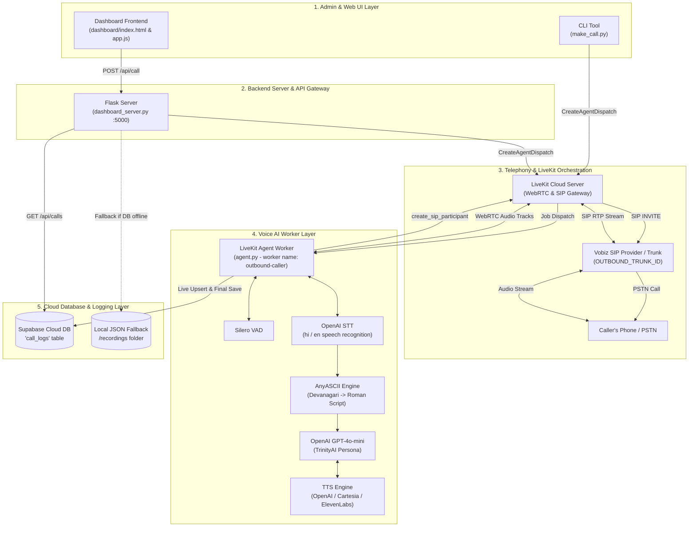
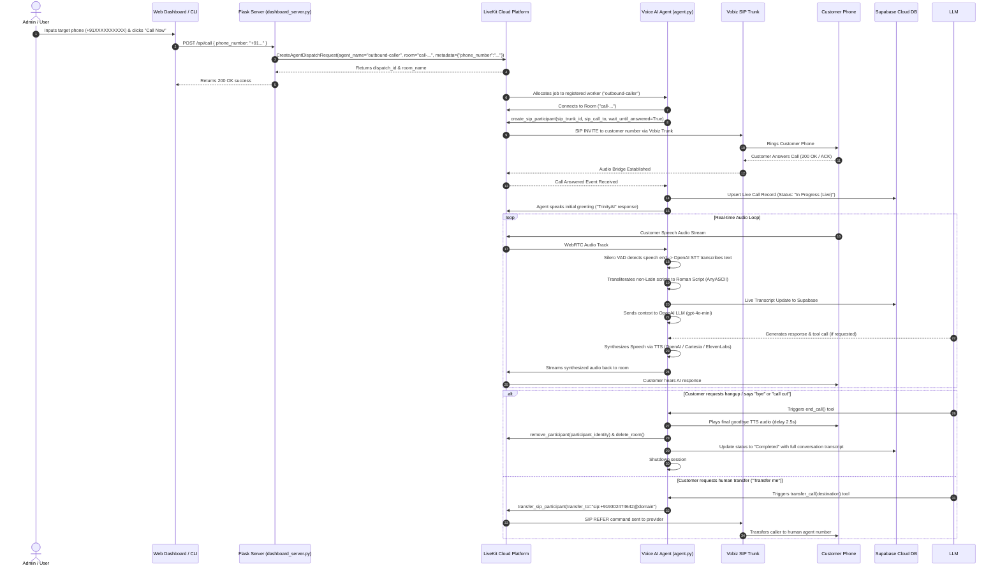

# 🏗️ TrinityAI Calling Agent — System Architecture & Implementation Guide

Welcome to the complete architectural and operational documentation for the **TrinityAI Calling Agent** system. This document explains every component, workflow, data model, API integration, speech-AI pipeline, telephony trunking mechanism, and database sync in exhaustive detail.

---

## 📌 Executive Summary

**TrinityAI Calling Agent** is an enterprise-grade, automated outbound voice platform designed for interactive telephonic communication over PSTN (Public Switched Telephone Network) using AI.

It allows operators to dispatch automated AI phone calls from a web dashboard or CLI tool to any mobile/landline number. When answered, an intelligent conversational female persona (**TrinityAI**) engages the user in real-time Hinglish/English dialogue, answers business queries, logs transcripts live to Supabase Cloud, transfers calls to human agents via SIP REFER when requested, and cleanly terminates calls upon completion.

---

## 🏛️ System Architecture Overview

The system consists of **5 interconnected core layers**:



---

## 🧩 Component Responsibility Matrix

| File / Component | Tech Stack | Primary Responsibility |
| :--- | :--- | :--- |
| [`agent.py`](file:///c:/Users/user/Calling%20Agent/Calling%20Agent/agent.py) | Python, `livekit-agents` 1.5.8, OpenAI, Silero, Cartesia, ElevenLabs, Anyascii, Supabase | The main Voice AI Worker process (`outbound-caller`). Runs VAD, STT, LLM, TTS, tools (`transfer_call`, `end_call`), and live database logging. |
| [`dashboard_server.py`](file:///c:/Users/user/Calling%20Agent/Calling%20Agent/dashboard_server.py) | Python, Flask, Flask-CORS, LiveKit API SDK, Supabase Client | Backend REST API server running on port `5000`. Serves web dashboard static files, dispatches call requests to LiveKit, and fetches/deletes transcripts from Supabase. |
| [`dashboard/app.js`](file:///c:/Users/user/Calling%20Agent/Calling%20Agent/dashboard/app.js) | Native JavaScript (ES6+), DOM, Fetch API, SweetAlert2 | Frontend single-page application logic. Controls call initiation modal, live polling of active/completed calls, transcript viewing modal, and stats rendering. |
| [`dashboard/index.html`](file:///c:/Users/user/Calling%20Agent/Calling%20Agent/dashboard/index.html) | HTML5, Vanilla CSS, FontAwesome | User interface layout for call logs, call status indicators, statistics counters, and call trigger forms. |
| [`make_call.py`](file:///c:/Users/user/Calling%20Agent/Calling%20Agent/make_call.py) | Python, LiveKit API SDK | Standalone CLI script to trigger an outbound call to a given target number via `--to +91XXXXXXXXXX`. |
| [`setup_trunk.py`](file:///c:/Users/user/Calling%20Agent/Calling%20Agent/setup_trunk.py) | Python, LiveKit API SDK | Utility script that updates SIP outbound trunk credentials (SIP domain, username, password, numbers) on LiveKit Cloud to eliminate SIP auth errors. |
| [`get_my_trunk.py`](file:///c:/Users/user/Calling%20Agent/Calling%20Agent/get_my_trunk.py) | Python, LiveKit API SDK | Inspects or automatically provisions an outbound SIP trunk in LiveKit Cloud. |
| [`recordings/`](file:///c:/Users/user/Calling%20Agent/Calling%20Agent/recordings) | JSON Files | Local storage directory used as a fallback store when Supabase is unreachable or unconfigured. |

---

## 🔄 Complete Call Lifecycle & Data Flow

Below is the step-by-step sequence of events when an outbound call is placed and processed:



---

## 🧠 Deep-Dive: Core Subsystems & Logic

### 1. LiveKit Agents Framework & Patching (`agent.py`)

`agent.py` uses `livekit-agents` v1.5.8. 
Because of a known serialization issue in Pydantic within `livekit-agents` v1.5.8 regarding `cc.Instructions` and `cc.ChatMessage`, `agent.py` implements a custom Pydantic core schema validator patch before loading models:

```python
# Patches livekit-agents 1.5.8 Pydantic serialization bug for ChatMessage/Instructions
cc.Instructions.__get_pydantic_core_schema__ = _patched_instructions_pydantic_schema
cc.ChatMessage.model_rebuild(force=True)
```

This prevents runtime `TypeError` or serialization exceptions when LiveKit agent history items are processed.

---

### 2. Multi-Script Transliteration Engine (`ensure_roman_script`)

To guarantee clean text representation in logs and prevent encoding errors across different system environments, every input and output string passes through `ensure_roman_script()` powered by `anyascii`.

If the text contains non-ASCII or non-Latin Unicode characters (Devanagari, Arabic, CJK, etc.), it converts them into phonetic Roman English equivalent characters.

---

### 3. Speech-to-Text, Voice Activity Detection & Text-to-Speech Setup

The agent session initializes a pipeline combining top-tier speech models:

*   **VAD (Voice Activity Detection)**: `silero.VAD.load()` detects when the caller starts and stops speaking with high precision.
*   **STT (Speech-to-Text)**: `openai.STT(language="hi")` transcribes speech in Hindi, Hinglish, and English.
*   **LLM (Language Model)**: `openai.LLM(model="gpt-4o-mini")` handles fast, cost-effective, real-time natural language understanding and dialogue generation.
*   **TTS (Text-to-Speech)**: Dynamically selected via `.env`:
    *   `openai` (Default): `model="tts-1"`, `voice="alloy"`
    *   `cartesia`: `model="sonic-2"`, `voice="f786b574-daa5-4673-aa0c-cbe3e8534c02"`
    *   `elevenlabs`: `model_id="eleven_multilingual_v2"`

---

### 4. System Prompt & Persona (`OutboundAssistant`)

The AI operates under strict instructions tailored for **Trinity Solutions**:

*   **Persona**: Female AI assistant named "TrinityAI" representing Trinity Solutions, Raipur.
*   **Domain Knowledge**: ERP Software (TMS, IMS, SMS, Inventory, Hospital), App/Web Development, Bulk SMS & WhatsApp APIs.
*   **Language & Tone**: Conversational Hinglish, Roman script only, warm and professional.
*   **Next Steps**: Offers human call transfer via tool call when requested.
*   **Disconnect Trigger**: Instantly calls `end_call` if the user wants to terminate the conversation.

---

### 5. AI Tool Context (`TransferFunctions`)

The agent is equipped with two custom tools registered with the LLM context:

#### `transfer_call(destination)`
*   Formats destination phone numbers into a standard SIP URI (e.g. `sip:+919302474642@<VOBIZ_SIP_DOMAIN>`).
*   Identifies the target remote participant (`sip_<phone_number>`).
*   Executes `ctx.api.sip.transfer_sip_participant(...)` which issues a **SIP REFER** request to the Vobiz trunk.

#### `end_call()`
*   Scheduled when user indicates call completion.
*   Waits `2.5s` to allow final TTS audio ("Thank you for your time, bye!") to play completely over the audio track.
*   Executes `ctx.api.room.remove_participant` to disconnect the phone call.
*   Deletes the LiveKit room (`ctx.api.room.delete_room`) and shuts down the worker job (`ctx.shutdown()`).

---

### 6. Cloud Database & Live Sync (Supabase)

`agent.py` hooks into `AgentSession` events:
*   `conversation_item_added`
*   `user_transcript_finished`
*   `agent_transcript_finished`

As each speaker finishes a phrase, the agent updates the corresponding record in the Supabase `call_logs` table with `status = "In Progress (Live)"`. When the call ends, the shutdown callback updates the record to `status = "Completed"` with the final array of message objects.

---

## 🗄️ Database Schema (`call_logs`)

The system relies on a single Supabase PostgreSQL table named `call_logs`:

```sql
CREATE TABLE public.call_logs (
    id UUID PRIMARY KEY DEFAULT gen_random_uuid(),
    phone_number TEXT NOT NULL,
    room_name TEXT NOT NULL,
    status TEXT NOT NULL DEFAULT 'In Progress (Live)',
    conversation JSONB NOT NULL DEFAULT '[]'::jsonb,
    total_messages INT NOT NULL DEFAULT 0,
    created_at TIMESTAMPTZ DEFAULT NOW()
);
```

### JSON Structure of `conversation` field:
```json
[
  {
    "role": "ai",
    "text": "Hello! Main TrinityAI bol rahi hoon Trinity Solutions se. Kaise help kar sakti hoon aapki?",
    "timestamp": "13:15:02"
  },
  {
    "role": "human",
    "text": "Mujhe transport software ke baare me poochna hai.",
    "timestamp": "13:15:08"
  }
]
```

---

## 🌐 Flask REST API Endpoints (`dashboard_server.py`)

The Flask server running at `http://localhost:5000` provides the following endpoints:

| Endpoint | Method | Description |
| :--- | :--- | :--- |
| `/` | `GET` | Serves the main Dashboard web UI (`dashboard/index.html`). |
| `/api/config` | `GET` | Returns system config (outbound number, default transfer number, status). |
| `/api/call` | `POST` | Validates target phone number, generates unique room name (`call-<num>-<rand>`), and creates LiveKit dispatch request. |
| `/api/calls` | `GET` | Fetches list of all call records from Supabase Cloud (falls back to local `.json` files in `/recordings` if DB is down). |
| `/api/calls/<call_id>` | `GET` | Fetches details and full conversation transcript for a specific call ID. |
| `/api/calls/<call_id>` | `DELETE` | Deletes a call record from Supabase Cloud and local storage. |

---

## ⚙️ Environment Variables Reference (`.env`)

```env
# LiveKit Cloud Credentials
LIVEKIT_URL=wss://your-domain.livekit.cloud
LIVEKIT_API_KEY=APIxxxxxxxxxxxx
LIVEKIT_API_SECRET=secretxxxxxxxxxxxxxxxxxxxxxxxxxxxxxxxx

# Vobiz SIP Trunk Configuration
VOBIZ_SIP_DOMAIN=your-domain.sip.vobiz.ai
VOBIZ_USERNAME=your_sip_username
VOBIZ_PASSWORD=your_sip_password
VOBIZ_OUTBOUND_NUMBER=+91XXXXXXXXXX
OUTBOUND_TRUNK_ID=ST_XXXXXXXXXXXX

# AI Provider Keys
OPENAI_API_KEY=sk-proj-xxxxxxxxxxxxxxxxxxxxxxxxxxxxxxxx

# TTS Engine Selection (openai / cartesia / elevenlabs)
TTS_PROVIDER=openai
OPENAI_TTS_VOICE=alloy
OPENAI_TTS_MODEL=tts-1

# Optional TTS Providers
# CARTESIA_API_KEY=...
# CARTESIA_TTS_MODEL=sonic-2
# ELEVEN_API_KEY=...
# ELEVEN_VOICE_ID=...

# Default Transfer Destination Number
DEFAULT_TRANSFER_NUMBER=+919302474642
TRANSFER_DESTINATION_NUMBER=+919302474642

# Supabase Cloud Database Credentials
SUPABASE_URL=https://xxxxxxxxxxxx.supabase.co
SUPABASE_SECRET_KEY=eyJhbGciOiJKV1QiLCJhbG...
SUPABASE_PUBLISHABLE_KEY=eyJhbGciOiJKV1...
```

---

## 🚀 How to Run the System

### 1. Update SIP Trunk Credentials (One-time or when SIP credentials change)
```powershell
python setup_trunk.py
```

### 2. Start the Voice AI Worker
In Terminal 1:
```powershell
python agent.py start
```

### 3. Start the Web Dashboard Backend Server
In Terminal 2:
```powershell
python dashboard_server.py
```
Open your browser and navigate to: `http://localhost:5000`

### 4. Trigger Outbound Calls
*   **Via Web Dashboard**: Click "+ New Call", select Country Code (`+91`), enter 10-digit Mobile Number, and click **Initiate Call**.
*   **Via CLI**:
    ```powershell
    python make_call.py --to +91XXXXXXXXXX
    ```

---

## 🛠️ Troubleshooting & Diagnostic Guide

| Failure / Symptom | Possible Root Cause | Resolution Step |
| :--- | :--- | :--- |
| **SIP Status 500 (Max Auth Retry)** | Incorrect SIP credentials in LiveKit Trunk configuration. | Run `python setup_trunk.py` to sync username & password with LiveKit Cloud. |
| **SIP Status 408 (Request Timeout)** | Customer phone did not answer, number invalid, or carrier block. | Verify phone number format (+91...). Test calling the number directly from a softphone. |
| **Agent connects but doesn't speak** | `wait_until_answered` event did not fire, or TTS API key expired. | Check agent console log output. Verify `OPENAI_API_KEY` validity. |
| **Supabase logs not updating** | Missing or incorrect `SUPABASE_URL` or `SUPABASE_SECRET_KEY`. | Verify `.env` keys. System automatically falls back to local `/recordings` folder. |
| **Call transfer fails** | SIP REFER disabled on provider side or target number improperly formatted. | Verify `VOBIZ_SIP_DOMAIN` is set in `.env` and SIP REFER is enabled in Vobiz portal. |

---

> **Document Summary**: This document covers TrinityAI's architecture, sequence flows, database structure, API endpoints, speech processing pipelines, tool contexts, environment configurations, and operational commands. Keep this file updated whenever adding new features or changing infrastructure.
